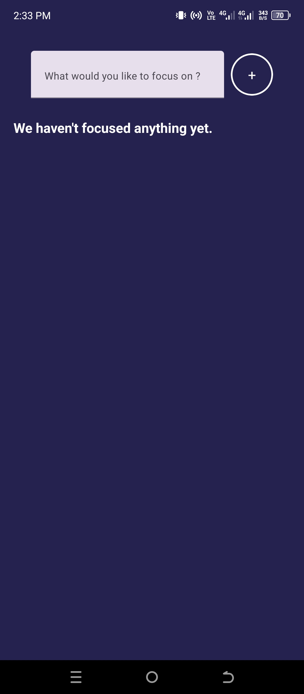
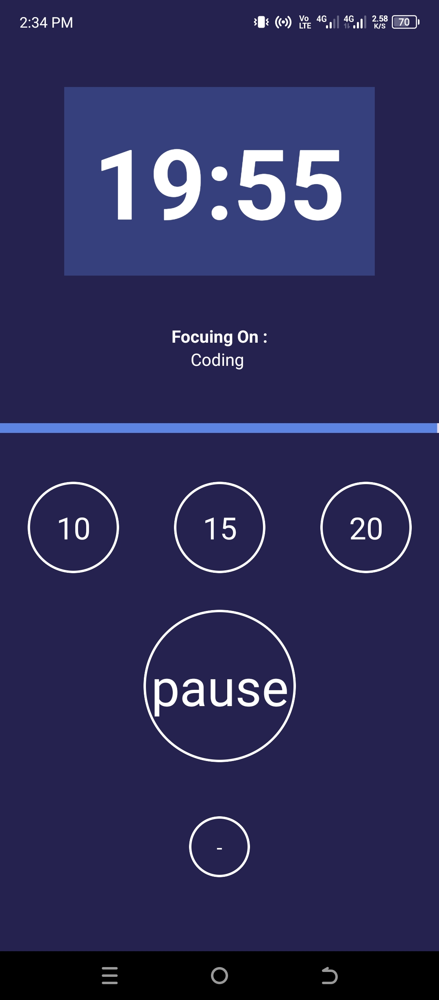

# YourAppName


## Table of Contents

- [Overview](#overview)
- [Features](#features)
- [Screenshots](#screenshots)
- [Installation](#installation)
- [Usage](#usage)
- [Contributing](#contributing)
- [License](#license)
- [Contact](#contact)

## Overview

**YourAppName** is a productivity mobile application built with React Native and Expo. It allows users to input tasks and focus on them for predetermined time intervals (10, 15, 20 minutes) to enhance concentration and productivity. Whether you're studying, working, or managing daily tasks, **YourAppName** helps you stay on track and manage your time effectively.

## Features

- **Task Management:** Easily add the tasks.
- **Custom Focus Timers:** Choose from preset focus durations (10, 15, 20 minutes) or set a custom timer.
- **Progress Tracking:** Visual progress bars to monitor your focus sessions.
- **Vibration:** Receive Vibration when your focus session ends.
- **History** Tasks History can see the user.
- **User-Friendly Interface:** Clean and intuitive design for seamless navigation.

## Installation

Follow these steps to set up and run the project locally.

### Prerequisites

- **Node.js** (v14 or later)
- **npm** or **yarn**
- **JDK**
- **SDK**
- **Expo CLI:** Install globally using `npm install -g expo-cli`

### Steps

1. **Clone the Repository**

   ```bash
   git clone https://github.com/UzairKhan313/react-navtive-focus-time.git
   cd react-navtive-focus-time
   ```

2. **Install the Dependencies**

   ```bash
   npm install
   ```

3. **Run App**

   ```bash
   npm start
   ```

## Screenshots




